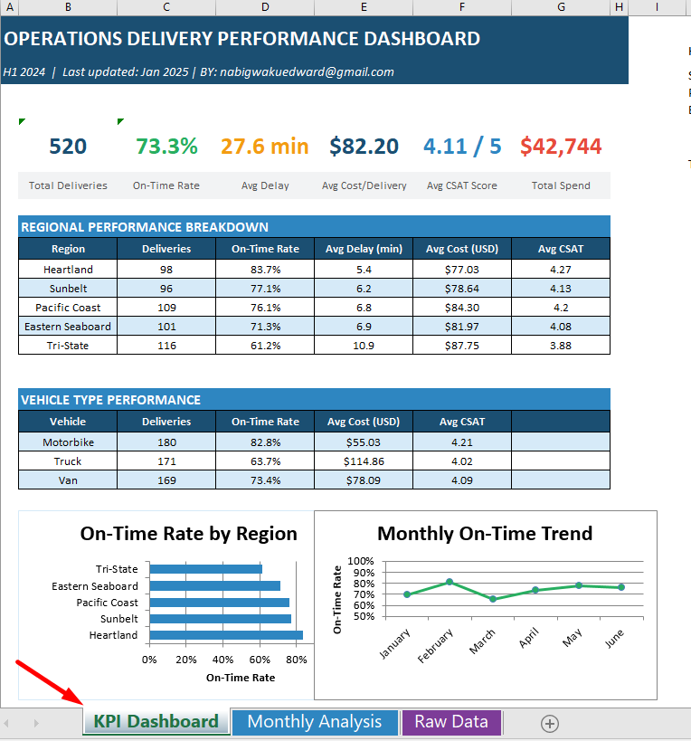
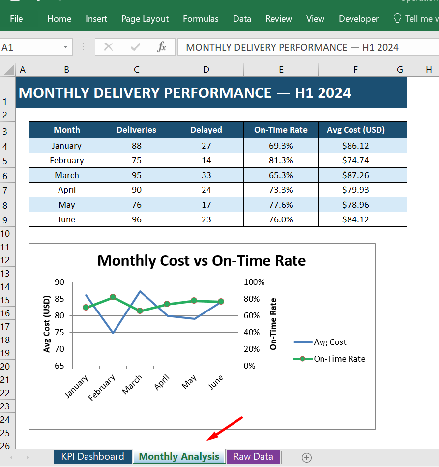
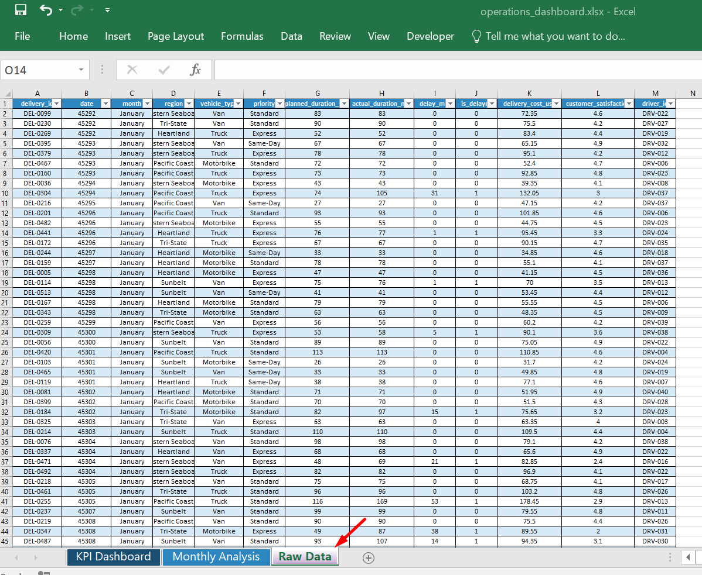
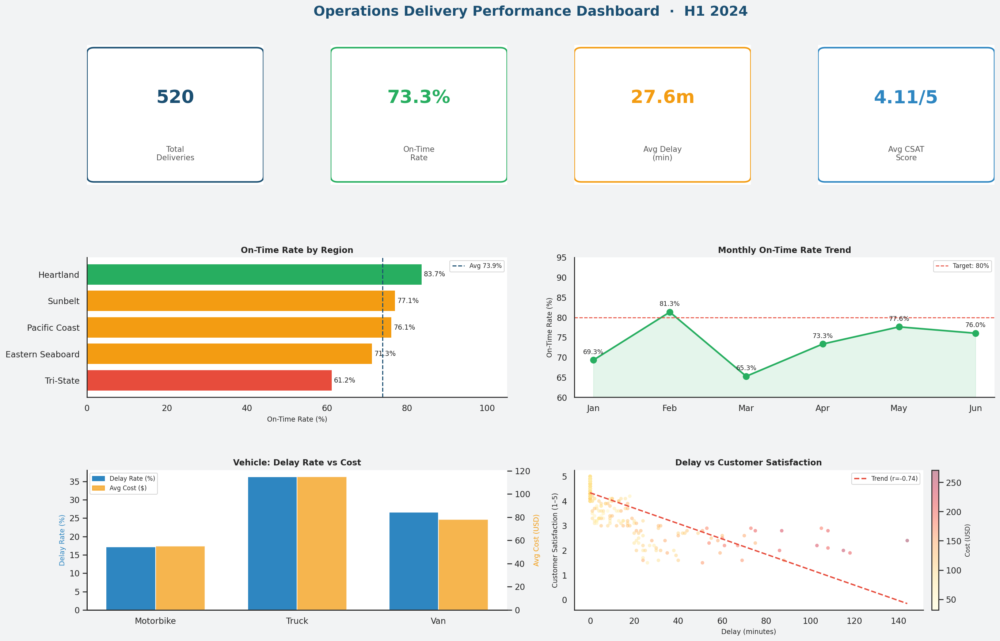

# Delivery Performance Analysis – Operations Analytics

**Department:** Operations  
**Tools Used:** Python · Excel Dashboard · xlsxwriter · Matplotlib · Seaborn  
**Data:** 520 deliveries, H1 2024  
**Business Domain:** delivery optimisation

---

## Project Overview
This project analyses delivery performance across multiple operational regions for a logistics operation during the first half of 2024.

The objective is to identify operational bottlenecks affecting delivery timeliness, customer satisfaction, and delivery costs. Using Python for analysis and Excel for reporting, the project converts raw operational records into actionable insights that support fleet planning and regional performance management.

The analysis gears towards monitoring service reliability and optimization delivery-operations.


# Business Problem

Delivery reliability is one of the most important drivers of both customer satisfaction and operational efficiency in logistics.

Over recent months, leadership observed several warning signs:

- An increase in customer complaints related to late deliveries  
- Rising operational costs in certain regions  
- Limited visibility into which drivers, vehicles, or routes were driving delays  

Without a clear performance monitoring framework, operational decisions such as fleet allocation and driver scheduling were largely based on experience rather than structured data analysis.

### Key Questions

The operations leadership team needed answers to three core questions:

1. Where are delivery delays occurring most frequently?  
2. Are delays affecting customer satisfaction and operational cost?  
3. Which vehicle types provide the best cost-to-performance balance?

Answering these questions enables more effective allocation of fleet resources and targeted operational improvements.


# Data Overview

The analysis uses operational delivery records covering the first half of 2024.

Each row represents a completed delivery and includes both operational metrics and customer feedback data.

### Key Variables

- Delivery date  
- Delivery region  
- Assigned driver  
- Vehicle type  
- Delivery priority level  
- Delivery delay (minutes)  
- Delivery cost  
- Customer satisfaction score (CSAT)

### Dataset Summary

- ~520 deliveries analysed  
- 5 operational regions  
- 40 delivery drivers  
- Multiple vehicle types (Motorbike, Van, Truck)

The dataset allows performance analysis across **regional, vehicle, and driver levels**, making it possible to isolate operational bottlenecks.


# Analytics Pipeline

Project Analytics workflow.


This structure ensures the analysis can esily be re-produced and maintained as new delivery data becomes available.

# Project Structure

``` text 
ops-delivery-optimisation/
│
├── data/
│ ├── raw/ # Source delivery records
│ └── processed/ # Cleaned analysis dataset
│
├── src/
│ ├── generate_data.py # Data preparation
│ ├── analysis.py # Performance analysis and charts
│ └── build_excel.py # Excel dashboard generation
│
├── reports/
│ └── figures/ # Generated charts
│
├── excel/
│ └── operations_dashboard.xlsx # Final stakeholder dashboard
│
├── requirements.txt
└── README.md

```


# Operational KPIs

Developed extra-operational metrics to evaluate delivery performance.

| KPI | Definition | Business Use |
|----|----|----|
| On-Time Delivery Rate | Percentage of deliveries completed within target window | Measures service reliability |
| Average Delay | Mean delay duration in minutes | Indicates operational inefficiency |
| Delivery Cost | Operational cost per delivery | Tracks cost efficiency |
| Customer Satisfaction (CSAT) | Post-delivery satisfaction score | Measures service experience |

These KPIs provide a consistent framework for monitoring delivery operations across regions.


# Key Findings

| Finding | Insight |
|------|------|
| Regional performance differs significantly | The North region shows the highest delay rate, more than double that of the Central region |
| Vehicle type strongly affects reliability | Truck deliveries show significantly higher delay rates than motorbike deliveries |
| Delay severity impacts customer satisfaction | Customer satisfaction declines sharply once delays exceed roughly 40 minutes |
| Certain service types show higher operational risk | Same-Day deliveries in the North region combine high cost with frequent delays |
| Motorbikes offer strong efficiency | They deliver the lowest delay rates while maintaining the lowest operational cost |


# Operational Recommendations

1. Fleet Allocation Optimisation
    - Rebalance vehicle allocation in high-delay regions. Motorbikes and vans demonstrate more reliable performance for time-sensitive deliveries.

2. Driver Performance Management
    - Identify and coach drivers with the highest delay rates to improve route discipline and departure timing.

3. Performance Targets
    - Introduce a formal operational KPI target:

4. On-Time Delivery Rate ≥ 80% across all regions
    - This provides a clear benchmark for operational improvement.

5. Continuous Monitoring
    - Use the Excel dashboard for ongoing monitoring of delivery performance and to detect emerging operational issues early.


# Excel Dashboard

The project delivers a stakeholder-focused Excel dashboard designed for operations managers.

The dashboard contains three primary sections:

### KPI Dashboard
- High-level operational metrics
- Regional performance comparisons
- Visual summaries of delivery trends



### Monthly Analysis
- Delivery performance by month
- Cost and reliability trends over time



### Raw Data
- Filterable dataset allowing deeper investigation of individual delivery records



This format allows both **executive monitoring and operational troubleshooting**.


# Visualisations Generated

With the analysis several visual outputs used within the dashboard:

## Charts Generated

| File | Description |
|---|---|
| `Regional delay rate comparison` | Horizontal bar: delay rate + CSAT by region |
| `Monthly delivery performance trends` | Dual-axis: on-time rate trend + avg cost per month |
| `ehicle performance comparison` | Side-by-side bars: delay, cost, CSAT by vehicle type |
| `Delay vs customer satisfaction relationship` | Scatter: delay minutes vs satisfaction (cost as colour) |
| `Region × delivery priority heatmap` | Heatmap: delay rate across region × priority combinations |
| `Driver performance distribution` | Top 5 vs Bottom 5 drivers by delay rate |

## Dashboard Generated (Combination of Charts above)



These charts translate operational data into insights that are easy for non-technical stakeholders to interpret.

# Business Impact

If implemented operationally, the analysis suggests several opportunities:

- Reduce delivery delays through improved fleet allocation  
- Improve customer satisfaction by addressing high-delay routes  
- Lower operational costs by prioritising efficient vehicle types  
- Enable data-driven decision-making for regional managers

Even modest improvements in on-time performance can significantly improve customer retention in delivery-based services.


